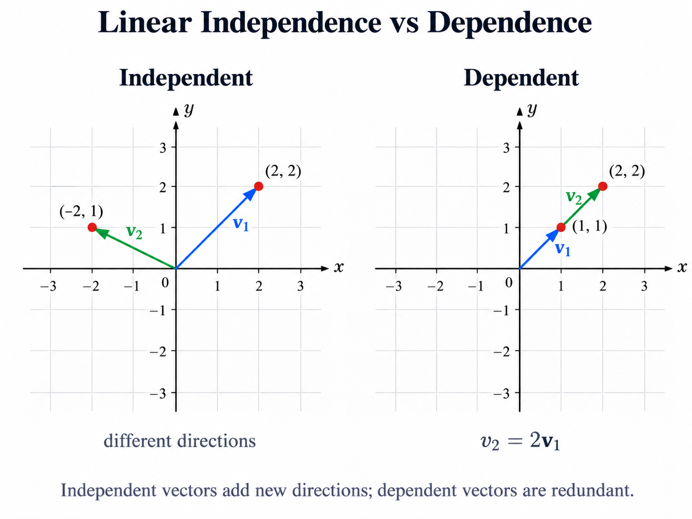
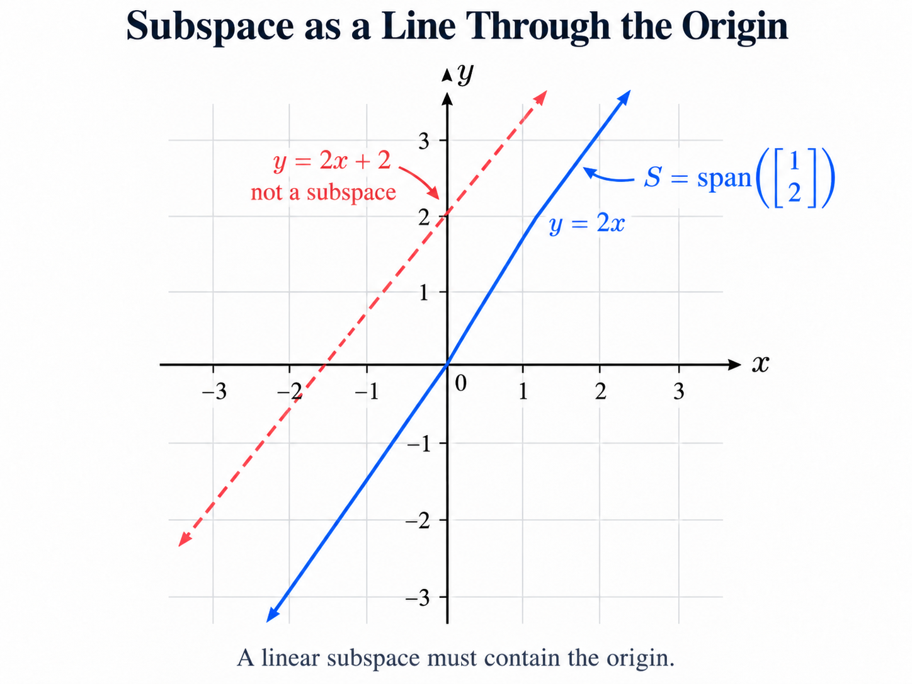

# 1. Linear Algebra — Vectors and Vector Spaces

## Key Takeaways

- A vector represents a point or direction in a multidimensional space.
- Linear combinations construct new vectors from existing vectors.
- The **span** is the set of all vectors reachable through linear combinations.
- Linear independence means that no vector can be reconstructed from the others.
- A **basis** is a linearly independent set that spans a vector space.
- The number of vectors in a basis defines the space's **dimension**.
- In Machine Learning, observations and parameters are commonly represented as vectors in high-dimensional spaces.

---

## 1. Scalars and Vectors

A **scalar** is a single number:

```math
a \in \mathbb{R}
```

A **vector** is an ordered collection of scalars:

```math
x =
\begin{bmatrix}
x_1 \\
x_2 \\
\vdots \\
x_d
\end{bmatrix}
\in \mathbb{R}^d
```

A vector can be interpreted both as a list of values and as a point or direction in a geometric space.

In Machine Learning, one observation with $d$ numerical features is commonly represented as:

```math
x \in \mathbb{R}^d
```

**Illustration:** A dataset with 100 features represents each observation as a point in $\mathbb{R}^{100}$.

---

## 2. Vector Operations

Two basic operations define how vectors interact.

### Vector Addition

```math
x+y=
\begin{bmatrix}
x_1+y_1 \\
\vdots \\
x_d+y_d
\end{bmatrix}
```

### Scalar Multiplication

For a scalar $\alpha$:

```math
\alpha x=
\begin{bmatrix}
\alpha x_1 \\
\vdots \\
\alpha x_d
\end{bmatrix}
```

Scalar multiplication stretches, shrinks or reverses a vector.

These operations appear directly in optimization:

```math
\theta_{t+1}
=
\theta_t
-
\eta \nabla_\theta J(\theta_t)
```

where both the parameters and the gradient are vectors.

---

## 3. Linear Combinations and Span

Given vectors $v_1,\ldots,v_k$, a **linear combination** is:

```math
\alpha_1v_1+\alpha_2v_2+\cdots+\alpha_kv_k
```

The **span** contains every vector that can be generated from these combinations:

```math
\operatorname{span}(v_1,\ldots,v_k)
=
\left\{
\sum_{i=1}^{k}\alpha_i v_i
\;\middle|\;
\alpha_i\in\mathbb{R}
\right\}
```

A single non-zero vector spans a line through the origin. Two independent vectors in $\mathbb{R}^2$ span the whole plane.

In Machine Learning, the expression:

```math
Xw
```

is a linear combination of the columns of $X$. Therefore every prediction produced by a linear model belongs to the span of those columns.

---

## 4. Linear Independence

Vectors $v_1,\ldots,v_k$ are **linearly independent** when:

```math
\alpha_1v_1+\cdots+\alpha_kv_k=0
```

implies:

```math
\alpha_1=\cdots=\alpha_k=0
```

If one vector can be constructed from the others, the vectors are linearly dependent.

For example:

```math
v_2=2v_1
```

means that $v_2$ introduces no new direction.

**Illustration:** If one feature is an exact linear combination of other features, it adds no new linear information and contributes to rank deficiency.

<p align="center">
  
</p>

---

## 5. Basis and Dimension

A **basis** of a vector space is a set of vectors that:

1. is linearly independent;
2. spans the entire space.

The standard basis of $\mathbb{R}^2$ is:

```math
e_1=
\begin{bmatrix}
1\\
0
\end{bmatrix},
\qquad
e_2=
\begin{bmatrix}
0\\
1
\end{bmatrix}
```

Every vector can then be written as:

```math
x=x_1e_1+x_2e_2
```

The **dimension** of a vector space is the number of vectors in any basis:

```math
\dim(\mathbb{R}^d)=d
```

A basis can be viewed as a coordinate system. Different bases describe the same space using different directions.

---

## 6. Vector Spaces and Subspaces

A **vector space** is a set closed under vector addition and scalar multiplication.

The main space used in Machine Learning is:

```math
\mathbb{R}^d
```

A **subspace** is a smaller vector space contained inside another one.

For example:

```math
S=
\operatorname{span}
\left(
\begin{bmatrix}
1\\
2
\end{bmatrix}
\right)
\subset \mathbb{R}^2
```

is a one-dimensional line through the origin.

Subspaces appear throughout Machine Learning: linear regression works with column spaces, PCA searches for lower-dimensional subspaces, and SVD identifies important directions inside a matrix.

<p align="center">
  
</p>

---

## 7. Conceptual Hierarchy

The main concepts connect as follows:

```text
Vectors
   ↓
Linear combinations
   ↓
Span
   ↓
Linear independence
   ↓
Basis
   ↓
Dimension
```

For a dataset:

```math
X\in\mathbb{R}^{n\times d}
```

each row is an observation in $\mathbb{R}^d$, while dependencies between the columns determine how many genuinely independent directions exist in the data.
