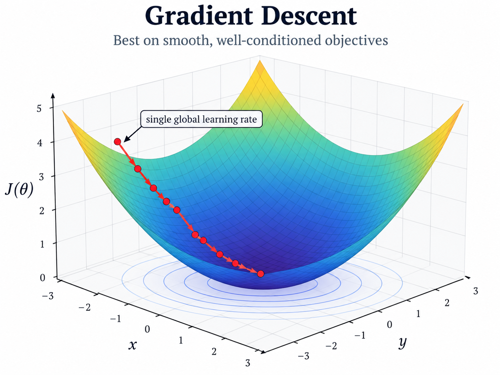
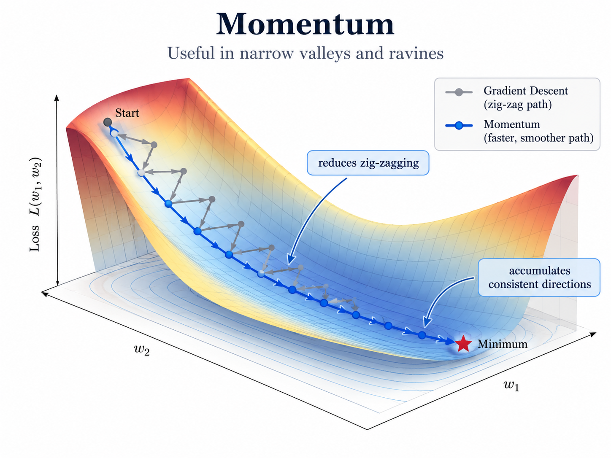
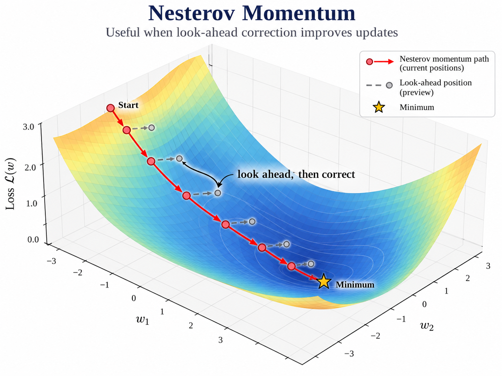
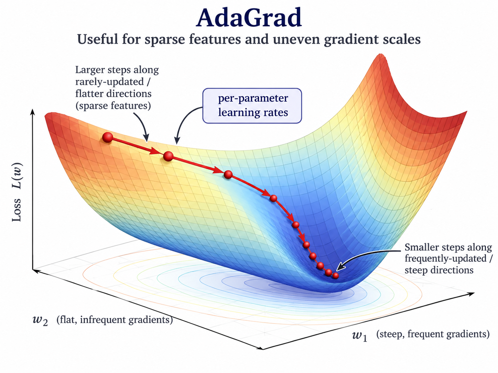
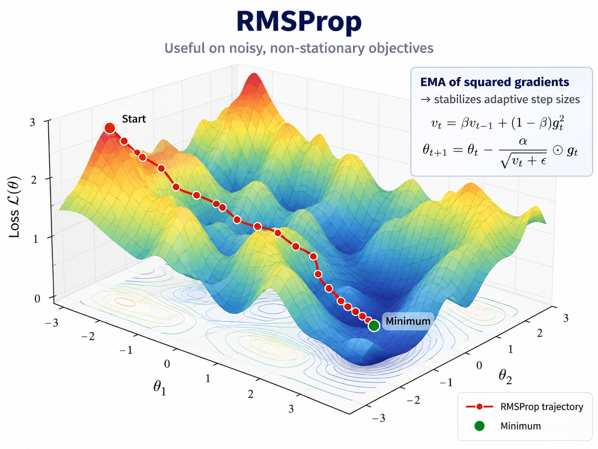
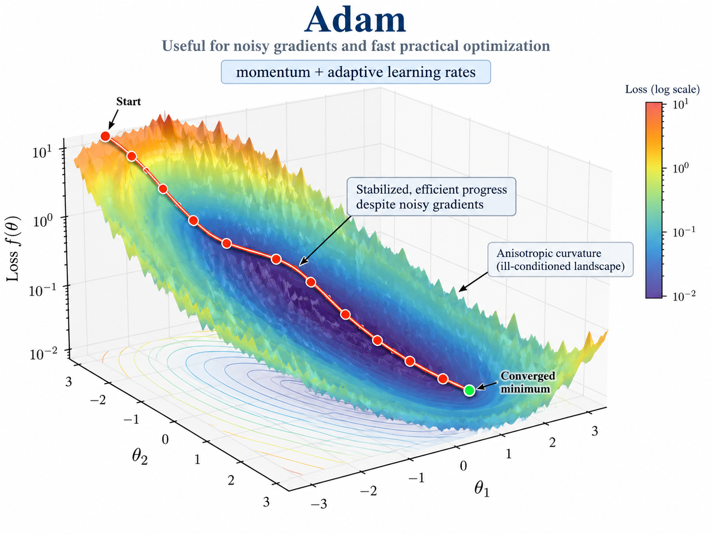

# 10. Optimization — Momentum and Adaptive Optimizers

## Key Takeaways

- Plain Gradient Descent can be inefficient in narrow valleys or when gradients have very different scales across parameters.
- **Momentum** accumulates past directions to reduce oscillation and accelerate movement along consistent directions.
- **Nesterov Momentum** evaluates the gradient at a look-ahead point and corrects the trajectory earlier.
- **AdaGrad** adapts the learning rate per parameter using accumulated squared gradients.
- **RMSProp** replaces AdaGrad's cumulative sum with an exponential moving average.
- **Adam** combines momentum-like first-moment tracking with adaptive second-moment scaling.
- Adaptive optimizers are useful in practice, but they are not universally superior to SGD with Momentum.

---

## 1. Why Plain Gradient Descent Can Be Inefficient

Plain Gradient Descent uses:

```math
\theta_{t+1}
=
\theta_t
-
\eta\nabla J(\theta_t).
```

This uses one global learning rate for every parameter.

On a well-conditioned objective, this can work very well.

<p align="center">
  
</p>

However, if the objective has very different curvature across directions, Gradient Descent may oscillate strongly in steep directions while making slow progress in flatter directions.

This motivates methods that either:

- accumulate useful directions over time; or
- scale updates differently across parameters.

---

## 2. Momentum

Momentum introduces a velocity term:

```math
v_t
=
\beta v_{t-1}
+
\nabla J(\theta_t),
```

followed by:

```math
\theta_{t+1}
=
\theta_t
-
\eta v_t.
```

The parameter:

```math
\beta\in[0,1)
```

controls how much of the previous direction is retained.

Momentum is especially useful in narrow valleys.

If gradients keep pointing in a similar direction, their contributions accumulate.

If gradients repeatedly change sign across a steep direction, those oscillations are partially cancelled.

```math
\boxed{
\text{Momentum}
=
\text{current gradient}
+
\text{memory of previous directions}
}
```

<p align="center">
  
</p>

**Illustration:** Momentum reduces zig-zagging across steep directions while building speed along a consistent descent direction.

---

## 3. Nesterov Momentum

Nesterov Momentum modifies the idea by computing the gradient at a **look-ahead position**.

A common form is:

```math
v_t
=
\beta v_{t-1}
+
\nabla J
\left(
\theta_t
-
\eta\beta v_{t-1}
\right),
```

then:

```math
\theta_{t+1}
=
\theta_t
-
\eta v_t.
```

Instead of measuring the gradient only at the current position, the method first estimates where momentum is about to take the parameters.

It then evaluates the gradient there and corrects the update earlier.

<p align="center">
  
</p>

**Illustration:** Nesterov Momentum looks ahead along the accumulated direction, then uses the gradient at that future point to adjust the trajectory.

### Quick numerical example

Let \(J(\theta)=(\theta-6)^2\), with \(\theta_t=5\), previous velocity \(u_{t-1}=2\), \(\beta=0.9\), and \(\eta=0.1\).

The momentum would first look ahead to:

```math
\theta_{\text{look}} = 5 + 0.9(2) = 6.8.
```

Since the optimum is at \(6\), this overshoots it. At the look-ahead point:

```math
\nabla J(6.8)=2(6.8-6)=1.6.
```

Nesterov uses this gradient to brake the motion:

```math
u_t = 0.9(2)-0.1(1.6)=1.64.
```

So instead of continuing with a momentum step of \(1.8\), the look-ahead gradient reduces it to \(1.64\): **look ahead → detect overshoot → brake**.

---

## 4. Adaptive Learning Rates

Momentum changes how directions are accumulated over time.

Adaptive optimizers solve a different problem: they change the **effective learning rate per parameter**.

Instead of applying:

```math
\eta
```

equally to all coordinates, adaptive methods rescale each coordinate using past gradient magnitudes.

This is useful when different parameters experience gradients with very different scales.

---

## 5. AdaGrad

AdaGrad accumulates squared gradients:

```math
s_t
=
s_{t-1}
+
g_t^2,
```

where:

```math
g_t
=
\nabla J(\theta_t)
```

and the square is applied element-wise.

The update is:

```math
\theta_{t+1}
=
\theta_t
-
\eta
\frac{g_t}
{\sqrt{s_t}+\varepsilon}.
```

Each parameter therefore receives its own effective learning rate.

Coordinates that repeatedly receive large gradients accumulate a large value in (s_t), reducing their future step sizes.

Coordinates with small or infrequent gradients retain relatively larger steps.

This makes AdaGrad especially useful for sparse features or strongly uneven gradient scales.

<p align="center">
  
</p>

The main weakness is that:

```math
s_t
```

keeps increasing.

Therefore the effective learning rate may eventually become extremely small.

---

## 6. RMSProp

RMSProp addresses AdaGrad's continuously growing denominator.

Instead of accumulating all past squared gradients equally, it uses an exponential moving average:

```math
s_t
=
\rho s_{t-1}
+
(1-\rho)g_t^2.
```

Then:

```math
\theta_{t+1}
=
\theta_t
-
\eta
\frac{g_t}
{\sqrt{s_t}+\varepsilon}.
```

Older gradients gradually lose influence.

This allows the adaptive scale to react to more recent gradient behavior rather than remembering the entire optimization history equally.

<p align="center">
  
</p>

**Illustration:** RMSProp stabilizes parameter-wise learning rates using a moving estimate of recent squared gradients.

---

## 7. Adam

Adam combines two ideas:

```math
\boxed{
\text{Momentum}
+
\text{adaptive parameter-wise scaling}
}
```

It tracks a moving average of gradients:

```math
m_t
=
\beta_1m_{t-1}
+
(1-\beta_1)g_t,
```

and a moving average of squared gradients:

```math
v_t
=
\beta_2v_{t-1}
+
(1-\beta_2)g_t^2.
```

The first quantity captures recent gradient direction.

The second captures recent gradient magnitude.

Because both are initialized at zero, Adam applies bias correction:

```math
\hat m_t
=
\frac{m_t}
{1-\beta_1^t},
```

and:

```math
\hat v_t
=
\frac{v_t}
{1-\beta_2^t}.
```

The update is:

```math
\boxed{
\theta_{t+1}
=
\theta_t
-
\eta
\frac{\hat m_t}
{\sqrt{\hat v_t}+\varepsilon}
}
```

<p align="center">
  
</p>

Conceptually:

```math
\hat m_t
\rightarrow
\text{direction memory}
```

while:

```math
\hat v_t
\rightarrow
\text{coordinate-wise scale control}.
```

---

## 8. Exponential Moving Averages

Momentum, RMSProp, and Adam all rely on exponential moving averages.

The general form is:

```math
z_t
=
\beta z_{t-1}
+
(1-\beta)x_t.
```

Recent values receive more weight, while older values decay exponentially.

A larger (eta) creates longer memory.

A smaller (eta) reacts more quickly to recent changes.

This mechanism lets optimizers smooth noisy gradient information without storing the entire optimization history.

---

## 9. Optimizer Comparison

| Optimizer | Main Idea | Useful When |
| --- | --- | --- |
| Gradient Descent | One global learning rate | Smooth, well-conditioned objectives |
| Momentum | Accumulate consistent directions | Narrow valleys, oscillating gradients |
| Nesterov | Look ahead before correcting | Momentum is useful but earlier correction helps |
| AdaGrad | Accumulate squared gradients | Sparse features, uneven gradient scales |
| RMSProp | EMA of squared gradients | Noisy or changing gradient scales |
| Adam | Momentum + adaptive scaling | General noisy large-scale optimization |

These are not completely separate algorithms conceptually.

They are different ways of modifying:

```math
\theta_{t+1}
=
\theta_t
-
\text{step}.
```

Momentum modifies the direction through history.

Adaptive methods modify the coordinate-wise scale.

Adam does both.

---

## 10. Practical Interpretation

The main parameters are:

- (eta): base learning rate;
- (eta): momentum memory;
- (
ho): RMSProp squared-gradient memory;
- (eta_1): Adam first-moment memory;
- (eta_2): Adam second-moment memory;
- (arepsilon): small numerical-stability constant.

The central distinction is:

```math
\boxed{
\text{Momentum changes how direction is accumulated}
}
```

while:

```math
\boxed{
\text{adaptive methods change how step size is scaled per parameter}
}
```

and:

```math
\boxed{
\text{Adam combines both mechanisms}
}
```

Adaptive optimizers often make rapid practical progress, especially with noisy gradients and high-dimensional models.

However, they are not automatically superior in every problem. SGD with Momentum can still be preferable depending on the model, task, and desired generalization behavior.
