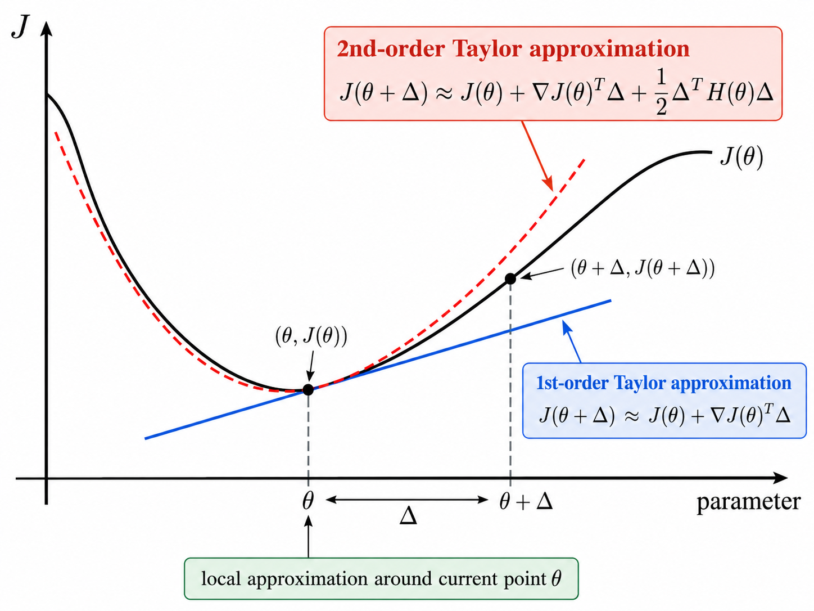

# 11. Optimization — Second-Order Optimization

## Key Takeaways

- First-order methods use the gradient; second-order methods also use curvature through the Hessian.
- Newton's method comes from minimizing the second-order Taylor approximation.
- The Newton step is:
\`\`\`math
\Delta_t=-H(\theta_t)^{-1}\nabla J(\theta_t).
\`\`\`
- The Hessian rescales the gradient according to curvature.
- Newton can converge very quickly near a well-behaved minimum, but full Hessian methods are expensive.
- In non-convex regions, the Newton direction is not always a descent direction.
- Damped Newton and line search control the step length.
- BFGS and L-BFGS approximate second-order information without forming the exact Hessian.

---

## 1. Why Second-Order Methods?

Gradient Descent uses:

\`\`\`math
\nabla J(\theta),
\`\`\`

which tells us the local slope.

Second-order methods also use:

\`\`\`math
H(\theta)=\nabla^2J(\theta),
\`\`\`

which describes local curvature.

\`\`\`math
\boxed{\nabla J(\theta)\rightarrow\text{slope}}
\`\`\`

\`\`\`math
\boxed{H(\theta)\rightarrow\text{curvature}}
\`\`\`

Curvature information can help choose steps that are better adapted to the local geometry.

---

## 2. First- vs Second-Order Taylor Approximation

The first-order approximation around \(\theta\) is:

\`\`\`math
J(\theta+\Delta)
\approx
J(\theta)+\nabla J(\theta)^\top\Delta.
\`\`\`

The second-order approximation adds curvature:

\`\`\`math
\boxed{
J(\theta+\Delta)
\approx
J(\theta)
+\nabla J(\theta)^\top\Delta
+\frac12\Delta^\top H(\theta)\Delta
}
\`\`\`

The quadratic term:

\`\`\`math
\frac12\Delta^\top H(\theta)\Delta
\`\`\`

models how the objective bends around the current point.

  

---

## 3. Deriving Newton's Method

Define the quadratic model:

\`\`\`math
q(\Delta)
=
J(\theta)
+\nabla J(\theta)^\top\Delta
+\frac12\Delta^\top H(\theta)\Delta.
\`\`\`

Choose \(\Delta\) to minimize this approximation.

Differentiate with respect to \(\Delta\):

\`\`\`math
\nabla_\Delta q
=
\nabla J(\theta)+H(\theta)\Delta.
\`\`\`

Set it equal to zero:

\`\`\`math
H(\theta)\Delta=-\nabla J(\theta).
\`\`\`

If \(H(\theta)\) is invertible:

\`\`\`math
\boxed{
\Delta=-H(\theta)^{-1}\nabla J(\theta)
}
\`\`\`

so:

\`\`\`math
\boxed{
\theta_{t+1}
=
\theta_t
-
H(\theta_t)^{-1}\nabla J(\theta_t)
}
\`\`\`

---

## 4. Newton's Method in One Dimension

In one dimension:

\`\`\`math
\nabla J(x)=J'(x),
\qquad
H(x)=J''(x).
\`\`\`

Therefore:

\`\`\`math
\boxed{
x_{t+1}
=
x_t
-
\frac{J'(x_t)}{J''(x_t)}
}
\`\`\`

assuming \(J''(x_t)\neq0\).

For example, if:

\`\`\`math
J(x)=x^2,
\`\`\`

then:

\`\`\`math
J'(x)=2x,
\qquad
J''(x)=2,
\`\`\`

and Newton gives:

\`\`\`math
x_{t+1}
=
x_t-\frac{2x_t}{2}
=
0.
\`\`\`

For this quadratic, Newton reaches the minimum in one ideal step.

---

## 5. How the Hessian Rescales the Gradient

Gradient Descent uses:

\`\`\`math
\Delta_{GD}=-\eta\nabla J.
\`\`\`

Newton uses:

\`\`\`math
\Delta_N=-H^{-1}\nabla J.
\`\`\`

For a symmetric Hessian:

\`\`\`math
H=Q\Lambda Q^\top,
\`\`\`

so:

\`\`\`math
H^{-1}=Q\Lambda^{-1}Q^\top.
\`\`\`

The eigenvectors in \(Q\) describe curvature directions, while the eigenvalues \(\lambda_i\) describe curvature magnitude.

Newton effectively scales a gradient component by:

\`\`\`math
\frac{1}{\lambda_i}.
\`\`\`

Therefore:

\`\`\`math
\lambda_i\text{ large}
\Rightarrow
\text{smaller movement},
\`\`\`

while:

\`\`\`math
\lambda_i\text{ small}
\Rightarrow
\text{larger movement}.
\`\`\`

The spectral decomposition is only an interpretation tool; Newton does not require explicitly computing it.

---

## 6. Multidimensional Quadratic Example

Consider:

\`\`\`math
J(\theta)
=
\frac12\theta^\top A\theta
-b^\top\theta,
\`\`\`

with symmetric \(A\).

Then:

\`\`\`math
\nabla J(\theta)=A\theta-b
\`\`\`

and differentiating again gives:

\`\`\`math
\boxed{
\nabla^2J(\theta)=A.
}
\`\`\`

So the Hessian is not assumed separately; it follows directly from the chosen quadratic objective.

To find a stationary point:

\`\`\`math
A\theta^*-b=0.
\`\`\`

Thus:

\`\`\`math
\theta^*=A^{-1}b
\`\`\`

when \(A\) is invertible.

If additionally:

\`\`\`math
A\succ0,
\`\`\`

the objective is strictly convex, so:

\`\`\`math
\boxed{
\theta^*=A^{-1}b
}
\`\`\`

is the unique global minimizer.

Newton also reaches this point in one ideal step for this quadratic objective.

---

## 7. Convergence and Computational Cost

Near a sufficiently regular local minimum, Newton can have quadratic convergence:

\`\`\`math
\|\theta_{t+1}-\theta^*\|
\le
C\|\theta_t-\theta^*\|^2.
\`\`\`

This can be much faster than linear convergence once the iterates are close to the solution.

The cost is second-order information.

For:

\`\`\`math
\theta\in\mathbb{R}^d,
\`\`\`

the Hessian has size:

\`\`\`math
d\times d.
\`\`\`

A dense Hessian needs roughly \(O(d^2)\) storage, and solving:

\`\`\`math
H\Delta=-\nabla J
\`\`\`

with a dense direct method can cost approximately \(O(d^3)\).

In practice, Newton implementations solve this linear system rather than explicitly computing \(H^{-1}\).

---

## 8. Newton Is Not Always a Descent Direction

The Newton direction is:

\`\`\`math
d_N=-H^{-1}\nabla J.
\`\`\`

A descent direction must satisfy:

\`\`\`math
\nabla J^\top d_N<0.
\`\`\`

For Newton:

\`\`\`math
\nabla J^\top d_N
=
-\nabla J^\top H^{-1}\nabla J.
\`\`\`

If:

\`\`\`math
H\succ0,
\`\`\`

then \(H^{-1}\succ0\), so:

\`\`\`math
\nabla J^\top H^{-1}\nabla J>0
\`\`\`

for a nonzero gradient, which implies:

\`\`\`math
\nabla J^\top d_N<0.
\`\`\`

So Newton moves downhill.

But in a non-convex region, \(H\) can be indefinite. Then the quadratic form above is not guaranteed to be positive, and the Newton direction may fail to be a descent direction.

---

## 9. Damped Newton and Line Search

Define the Newton direction:

\`\`\`math
d_t
=
-H(\theta_t)^{-1}\nabla J(\theta_t).
\`\`\`

Instead of always taking the full step, use:

\`\`\`math
\boxed{
\theta_{t+1}
=
\theta_t+\alpha_t d_t
}
\`\`\`

with:

\`\`\`math
0<\alpha_t\le1.
\`\`\`

Here:

\`\`\`math
\boxed{d_t=\text{direction}}
\`\`\`

and:

\`\`\`math
\boxed{\alpha_t=\text{step length}}
\`\`\`

A **line search** chooses \(\alpha_t\) dynamically by testing candidate values along \(d_t\), for example:

\`\`\`math
1,\quad\frac12,\quad\frac14,\quad\frac18,\dots
\`\`\`

until the objective decreases sufficiently.

This makes Newton more conservative when a full step is too aggressive.

---

## 10. Quasi-Newton Methods

Quasi-Newton methods approximate curvature information from changes in parameters and gradients instead of explicitly forming the exact Hessian.

Two important methods are:

- **BFGS**
- **L-BFGS**

BFGS builds an approximation to the Hessian or inverse Hessian.

L-BFGS uses a limited-memory representation, making it more practical when storing a dense matrix is too expensive.

The conceptual progression is:

\`\`\`text
Gradient Descent
    ↓
gradient only

Newton
    ↓
exact Hessian information

Quasi-Newton
    ↓
approximate Hessian information
\`\`\`

---

## 11. Main Comparison

| Method | Information | Main Advantage | Main Limitation |
| --- | --- | --- | --- |
| Gradient Descent | Gradient | Cheap and scalable | Can be slow on ill-conditioned objectives |
| Newton | Gradient + Hessian | Very fast local convergence | Expensive Hessian and linear solve |
| Damped Newton | Newton direction + line search | More robust step control | Still expensive |
| BFGS | Approximate curvature | Strong practical convergence | Dense approximation can be costly |
| L-BFGS | Limited-memory curvature approximation | Lower memory cost | Still more complex than first-order methods |

The main distinction is:

\`\`\`math
\boxed{
\text{first-order methods use slope}
}
\`\`\`

while:

\`\`\`math
\boxed{
\text{second-order methods use slope + curvature}.
}
\`\`\`
