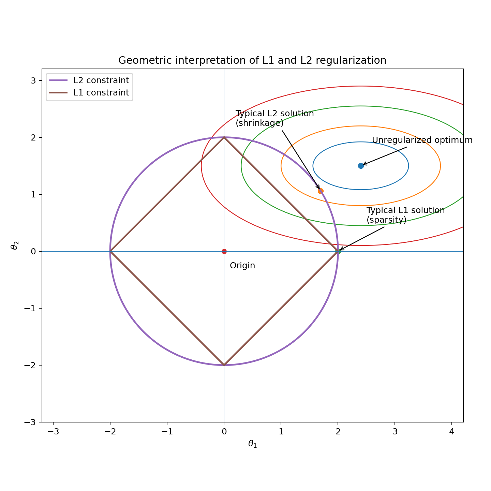

# 2. Optimization — Regularization

## Key Takeaways

- Regularization adds a penalty to the training objective in order to control model complexity.
- **L2 regularization** shrinks coefficients smoothly toward zero and usually keeps all features active.
- **L1 regularization** promotes sparsity and can set some coefficients exactly to zero.
- **Elastic Net** combines the sparsity of L1 with the stability of L2.
- The regularization strength is controlled by a hyperparameter and must be tuned.
- Regularization is especially important when the model is flexible or the number of features is large.
- Feature scaling is usually required before applying L1 or L2 penalties.

---

## 1. Introduction

Regularization is a mechanism used to reduce overfitting by penalizing overly complex parameter values.

A regularized objective can be written as:

```math
J_{\text{reg}}(\theta)
=
\hat{R}_n(\theta)
+
\lambda \Omega(\theta)
```

where:

- $\hat{R}_n(\theta)$ is the empirical risk;
- $\Omega(\theta)$ is the regularization penalty;
- $\lambda \ge 0$ controls the strength of the penalty.

When $\lambda=0$, there is no regularization.  
When $\lambda$ increases, the model is pushed toward simpler parameter values.

**Illustration:** Regularization accepts a slightly worse training fit in exchange for a model that generalizes better.

---

## 2. Why Regularization Is Needed

Minimizing empirical risk alone can lead to a model that adapts too closely to the training sample.

This is especially problematic when:

- the model is highly flexible;
- the dataset is small;
- the input dimension is large;
- features are noisy or redundant.

Regularization constrains the parameter space and reduces sensitivity to random fluctuations in the training data.

**Illustration:** A model with extremely large coefficients may fit the training set well but react too strongly to small input changes.

---

## 3. L2 Regularization

L2 regularization penalizes the squared magnitude of the coefficients:

```math
\Omega(\theta)=\|\theta\|_2^2
=
\sum_{j=1}^d \theta_j^2
```

The objective becomes:

```math
J(\theta)
=
\hat{R}_n(\theta)
+
\lambda
\sum_{j=1}^d \theta_j^2
```

In linear models, this is called **Ridge regularization**.

### 3.1 Optimization Effect

The derivative of the L2 penalty is:

```math
\nabla_\theta
\left(
\lambda \|\theta\|_2^2
\right)
=
2\lambda\theta
```

Therefore, a gradient update becomes:

```math
\theta_{t+1}
=
\theta_t
-
\eta
\left(
\nabla \hat{R}_n(\theta_t)
+
2\lambda\theta_t
\right)
```

This can be rewritten as:

```math
\theta_{t+1}
=
(1-2\eta\lambda)\theta_t
-
\eta\nabla \hat{R}_n(\theta_t)
```

So L2 continuously shrinks the parameters during optimization.

**Illustration:** L2 acts like a soft force that pulls every parameter back toward zero at each update step.

### 3.2 Main Behavior

L2 usually reduces all coefficients without setting many of them exactly to zero.

It is well suited when many features carry useful information and correlated features should share the weight.

**Illustration:** If two variables contain similar information, L2 often keeps both with smaller coefficients instead of removing one.

### 3.3 Stability Interpretation

For a linear model:

```math
f_\theta(x)=\theta^\top x
```

a small perturbation $\Delta x$ changes the output by:

```math
\Delta f = \theta^\top \Delta x
```

Using Cauchy–Schwarz:

```math
|\Delta f|
\le
\|\theta\|_2\|\Delta x\|_2
```

Controlling $\|\theta\|_2$ limits how strongly predictions react to input perturbations.

**Illustration:** Smaller L2 norm often means smoother and more stable predictions.

### 3.4 Geometric Interpretation

L2 regularization can be written as a constrained problem:

```math
\min_\theta \hat{R}_n(\theta)
\quad
\text{subject to}
\quad
\|\theta\|_2^2 \le c
```

In two dimensions, the constraint is:

```math
\theta_1^2 + \theta_2^2 \le c
```

which defines a circle centered at the origin. In higher dimensions, it defines a sphere.

The empirical-risk surface can be visualized by level sets:

```math
\hat{R}_n(\theta)=\text{constant}
```

These are often ellipses in parameter space.  
Without regularization, the optimizer chooses the center of the smallest loss contour.  
With L2 regularization, the optimizer must stay inside the circular feasible region.

The solution is therefore the tangency point between:

- a loss contour;
- the L2 constraint boundary.

Because the boundary is smooth and rounded, the tangency point generally has non-zero coordinates on several axes.  
This is why L2 shrinks coefficients smoothly but rarely produces exact zeros.

**Illustration:** The round geometry of the L2 ball encourages small coefficients everywhere rather than sparse solutions.



**Circle shape explanation:** The L2 norm measures the Euclidean distance of a point from the origin:

```math
\|\theta\|_2
=
\sqrt{\theta_1^2+\theta_2^2}
```

Therefore, all points with the same L2 norm are located at the same Euclidean distance from the origin. In two dimensions, the boundary

```math
\|\theta\|_2=c
```

is a circle centered at the origin, while the feasible set

```math
\|\theta\|_2\le c
```

is the interior of that circle. Equivalently, if the squared norm is constrained, then

```math
\theta_1^2+\theta_2^2\le c
```

forms a circle of radius $\sqrt{c}$. Every point on the boundary has the same L2 penalty, which explains why the L2 feasible region is circular in two dimensions and spherical in higher dimensions.

---

## 4. L1 Regularization

L1 regularization penalizes the absolute magnitude of the coefficients:

```math
\Omega(\theta)=\|\theta\|_1
=
\sum_{j=1}^d |\theta_j|
```

The objective becomes:

```math
J(\theta)
=
\hat{R}_n(\theta)
+
\lambda
\sum_{j=1}^d |\theta_j|
```

In linear models, this is called **Lasso regularization**.

### 4.1 Optimization Effect

For $\theta_j \neq 0$, the derivative is:

```math
\frac{\partial}{\partial \theta_j} |\theta_j|
=
\operatorname{sign}(\theta_j)
```

Thus, the penalty contributes:

```math
\lambda\operatorname{sign}(\theta_j)
```

The shrinkage force has constant magnitude and does not vanish near zero.

At zero, L1 is not differentiable, but it admits a subgradient.

**Illustration:** Unlike L2, L1 keeps pushing small coefficients strongly enough that some can become exactly zero.

**Note** : Because L1 keeps applying pressure near zero, it tends to eliminate weak parameters entirely.
This produces sparse solutions and can be interpreted as a form of feature selection.

**Illustration:** If many features are only weakly useful, L1 may keep a small subset and suppress the rest.

### 4.2 Geometric Interpretation

L1 can also be written as a constrained problem:

```math
\min_\theta \hat{R}_n(\theta)
\quad
\text{subject to}
\quad
\|\theta\|_1 \le c
```

In two dimensions, this becomes:

```math
|\theta_1|+|\theta_2|\le c
```

which defines a diamond-shaped feasible region.

The corners of this diamond lie on the coordinate axes.  
When a loss contour touches the feasible region, it is more likely to do so at a corner.  
At such points, one or more coordinates are exactly zero.

This geometric property explains why L1 promotes sparsity.

**Illustration:** The corners of the L1 constraint make axis-aligned solutions more likely than with L2.  

**Diamond shape explanation:** The L1 norm measures the total absolute displacement along the coordinate axes rather than the Euclidean distance:

```math
\|\theta\|_1
=
|\theta_1|+|\theta_2|
```

The feasible set is therefore

```math
|\theta_1|+|\theta_2|\le c
```

In each quadrant, the absolute values disappear with the appropriate signs, producing a straight-line boundary. For example, in the first quadrant the boundary is

```math
\theta_1+\theta_2=c
```

The four line segments meet at $(c,0)$, $(0,c)$, $(-c,0)$, and $(0,-c)$, forming a diamond centered at the origin. Thus, equal-L1-norm contours are diamonds in two dimensions.


**Note:** When several features are strongly correlated, L1 may select one and discard the others.
This can be useful for feature selection, but it may also make the solution less stable.
**Illustration:** If two features encode nearly the same signal, L1 may keep one arbitrarily and set the other to zero.

### 4.3 Why Does the Constraint Constant $c$ Disappear?

The connection between constrained and penalized formulations can be understood through the method of Lagrange multipliers. The details depend on the optimization problem, but the intuition is the same for L1 and L2 penalties.

Using L2 regularization as an example, start from the constrained problem:

```math
\min_\theta \hat{R}_n(\theta)
\quad
\text{subject to}
\quad
\|\theta\|_2^2 \le c
```

we form the Lagrangian:

```math
L(\theta,\lambda)
=
\hat{R}_n(\theta)
+
\lambda\left(\|\theta\|_2^2-c\right)
```

which expands to:

```math
L(\theta,\lambda)
=
\hat{R}_n(\theta)
+
\lambda\|\theta\|_2^2
-
\lambda c
```

The term $-\lambda c$ does not depend on $\theta$. Therefore, it is constant with respect to the parameters being optimized and does not affect the location of the optimum. This is why the penalized objective is usually written without it:

```math
J(\theta)
=
\hat{R}_n(\theta)
+
\lambda\|\theta\|_2^2
```

---

## 5. Elastic Net

Elastic Net combines L1 and L2 regularization:

```math
J(\theta)
=
\hat{R}_n(\theta)
+
\lambda_1 \|\theta\|_1
+
\lambda_2 \|\theta\|_2^2
```

A common parameterization is:

```math
J(\theta)
=
\hat{R}_n(\theta)
+
\lambda
\left[
\alpha \|\theta\|_1
+
(1-\alpha) \|\theta\|_2^2
\right]
```

where:

- $\alpha=1$ gives pure L1;
- $\alpha=0$ gives pure L2;
- intermediate values combine both effects.

Elastic Net is useful when:

- sparsity is desirable;
- features are correlated;
- pure L1 is unstable;
- pure L2 is not selective enough.

**Illustration:** Elastic Net can keep a small but stable subset of correlated predictors instead of choosing only one arbitrarily.

---

## 6. Choosing the Regularization Strength

The parameter $\lambda$ controls the trade-off between data fitting and simplicity.

```math
J(\theta)
=
\hat{R}_n(\theta)
+
\lambda \Omega(\theta)
```

- small $\lambda$: weak regularization and greater risk of overfitting;
- large $\lambda$: strong regularization and greater risk of underfitting.

The regularization strength should be selected using validation data or cross-validation.

**Illustration:** If $\lambda$ is too large, the model may become too simple to capture the useful structure in the data.

**Note:** L1 and L2 penalties depend directly on coefficient magnitude. If features have different scales, their coefficients are not penalized fairly. A common preprocessing step is standardization, which ensures that regularization compares coefficients on a consistent scale.

---

## 7. L1 vs L2 vs Elastic Net

| Property | L1 | L2 | Elastic Net |
|---|---|---|---|
| Penalty | $\sum_j |\theta_j|$ | $\sum_j \theta_j^2$ | Combination of L1 and L2 |
| Main effect | Sparsity | Shrinkage | Shrinkage + sparsity |
| Exact zeros | Frequent | Rare | Possible |
| Feature selection | Yes | No | Partial |
| Correlated features | May keep one | Tends to share weight | More stable than L1 |
| Differentiability | Not at zero | Everywhere | Mixed |

**Illustration:** L2 shrinks all features, L1 selects features, and Elastic Net balances both behaviors.

---

## 8. When to Use Each

Use **L2** when:

- most features are expected to contribute;
- correlated features should share information;
- stable coefficients are important.

Use **L1** when:

- many features may be irrelevant;
- sparsity and interpretability matter;
- feature selection is useful.

Use **Elastic Net** when:

- sparsity is desired;
- features are strongly correlated;
- pure L1 is too unstable.

**Illustration:** High-dimensional tabular problems often benefit from L1 or Elastic Net, while dense predictive settings often prefer L2.
