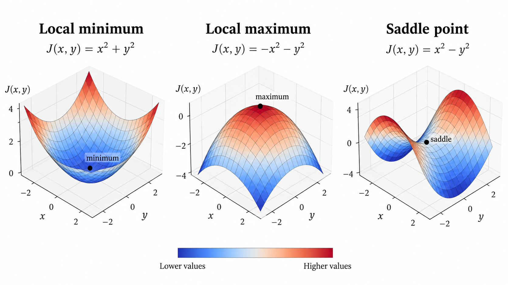
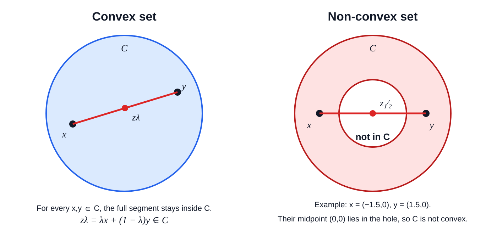
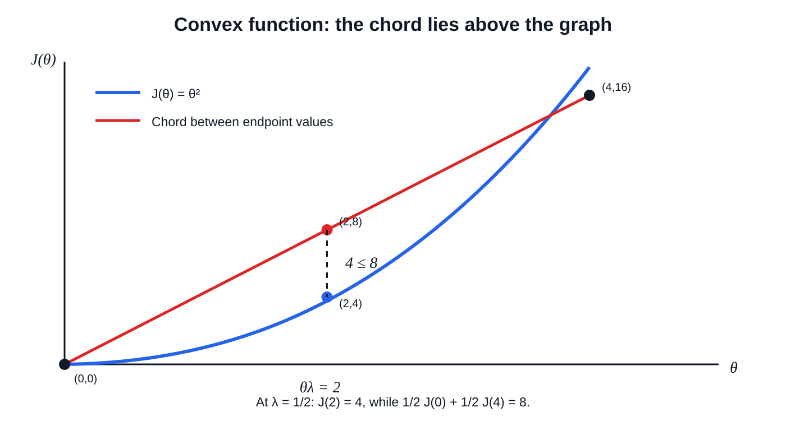
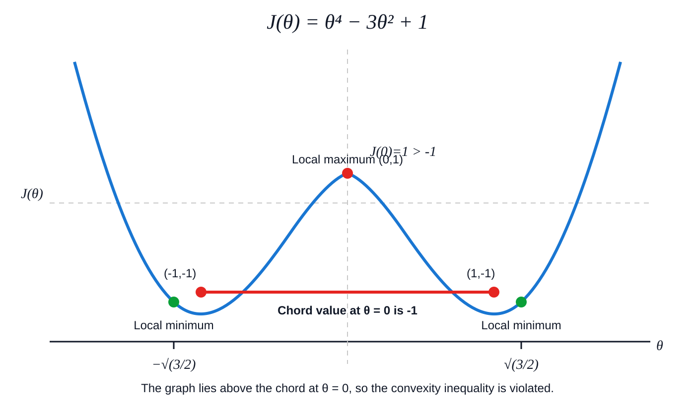

# 7. Optimization — Convexity and Critical Points

## Key Takeaways

- A **critical point** satisfies $\nabla J(\theta^{*})=0$, but it is not necessarily a minimum.
- The Hessian helps classify critical points through local curvature.
- For convex functions, every local minimum is also a global minimum.
- For differentiable convex functions, any stationary point is a global minimizer.
- Jensen's inequality is a direct consequence of convexity and compares the function of an average with the average of the function.
- Strong convexity adds a guaranteed amount of positive curvature and gives stronger optimization guarantees.
- For twice-differentiable functions, convexity and strong convexity can be characterized using the Hessian.

---

## 1. Critical and Stationary Points

A point $\theta^{*}$ is called a **critical point** or **stationary point** when:

```math
\nabla J(\theta^{*})=0.
```

At such a point, the first-order information vanishes.

However:

```math
\nabla J(\theta^{*})=0
```

does **not** automatically imply that $\theta^{*}$ is a minimum.

A stationary point may be:

- a local minimum;
- a local maximum;
- a saddle point.

**Illustration:** A zero slope can occur at the bottom of a valley, the top of a hill, or on a saddle-shaped surface.



---

## 2. Local Minimum, Maximum, and Saddle Point

A point $\theta^{*}$ is a **local minimum** if nearby points have objective values at least as large:

```math
J(\theta^{*})
\le
J(\theta)
```

for all $\theta$ sufficiently close to $\theta^{*}$.

Similarly, $\theta^{*}$ is a **local maximum** if:

```math
J(\theta^{*})
\ge
J(\theta)
```

for nearby $\theta$.

A **saddle point** is a stationary point that is neither a local minimum nor a local maximum.

At a saddle point, the objective may increase in some directions and decrease in others.

**Illustration:** A saddle point is locally uphill in one direction and downhill in another.

---

## 3. Hessian-Based Classification

For a twice-differentiable objective, the Hessian is:

```math
H(\theta)
=
\nabla^2 J(\theta).
```

At a stationary point $\theta^{*}$, the Hessian describes the local curvature.

If:

```math
H(\theta^{*}) \succ 0,
```

the Hessian is positive definite, and $\theta^{*}$ is a strict local minimum.

If:

```math
H(\theta^{*}) \prec 0,
```

the Hessian is negative definite, and $\theta^{*}$ is a strict local maximum.

If the Hessian has both positive and negative eigenvalues, it is indefinite, and $\theta^{*}$ is a saddle point.

If the Hessian is only semidefinite, the second-order test may be inconclusive.

**Illustration:** The Hessian tells us whether the surface bends upward, downward, or in mixed directions around a stationary point.

---

## 4. Convex Sets

Before defining convex functions, it helps to understand **convex sets**.

A set $C$ is convex if, for any two points $x,y\in C$ and any $\lambda\in[0,1]$,

```math
\lambda x+(1-\lambda)y\in C.
```

The expression

```math
z_\lambda=\lambda x+(1-\lambda)y
```

describes a point on the straight line segment between $x$ and $y$.

For example:

```math
\lambda=0 \Rightarrow z_\lambda=y,
```

```math
\lambda=\frac{1}{2} \Rightarrow z_\lambda=\frac{x+y}{2},
```

```math
\lambda=1 \Rightarrow z_\lambda=x.
```

As $\lambda$ moves from $0$ to $1$, $z_\lambda$ moves along the entire segment from $y$ to $x$.

> If two points are allowed, then every straight-line interpolation between them is also allowed.




A filled disk, rectangle, triangle, and $\mathbb{R}^n$ are convex sets. A ring, crescent-shaped region, U-shaped region, or two disconnected regions are generally **not** convex.

### Example: a non-convex ring

Consider

```math
C=\left\{(x_1,x_2)\in\mathbb{R}^2:1\le x_1^2+x_2^2\le 4\right\}.
```

Choose

```math
x=(-1.5,0),\qquad y=(1.5,0).
```

Both points belong to $C$. But for $\lambda=\frac12$,

```math
\frac12x+\frac12y=(0,0).
```

The point $(0,0)$ is not in $C$ because it lies in the hole of the ring. Therefore $C$ is not convex.

### Why the domain matters

When defining a convex function, we must evaluate the function at interpolated inputs such as

```math
\lambda\theta_1+(1-\lambda)\theta_2.
```

If the domain were not convex, this interpolated point could fall outside the domain, so the function might not even be defined there.

```text
convex set
    ↓
interpolated inputs remain valid
```

---

## 5. Convex Functions

Now suppose $J$ is defined on a convex set. The function is convex if, for any $\theta_1,\theta_2$ in its domain and any $\lambda\in[0,1]$,

```math
J\left(\lambda\theta_1+(1-\lambda)\theta_2\right)
\le
\lambda J(\theta_1)+(1-\lambda)J(\theta_2).
```

This compares **two different quantities**.

The left-hand side means:

> First interpolate the inputs, then evaluate the function.

The right-hand side means:

> First evaluate the function at the two endpoints, then interpolate their function values.

For a convex function, the first quantity can never be larger than the second.

Geometrically, if we take two points on the graph, $(\theta_1,J(\theta_1))$ and $(\theta_2,J(\theta_2))$, then the straight chord joining them lies **on or above** the graph of the function.

### Example: $J(\theta)=\theta^2$

Take

```math
\theta_1=0,\qquad \theta_2=4,\qquad \lambda=\frac12.
```

The interpolated input is

```math
\frac12(0)+\frac12(4)=2,
```

so

```math
J(2)=2^2=4.
```

Interpolating the endpoint values gives

```math
\frac12J(0)+\frac12J(4)=\frac12(0)+\frac12(16)=8.
```

Therefore,

```math
J(2)=4\le 8=\frac12J(0)+\frac12J(4).
```

The actual function value at the midpoint lies below the height of the straight chord connecting the two endpoint values.



### Non-convex comparison

For contrast, consider

```math
J(\theta)=\theta^4-3\theta^2+1.
```

Take \(\theta_1=-1\), \(\theta_2=1\), and \(\lambda=\frac12\). Then the interpolated input is \(0\), and

```math
J(0)=1,
```

while the interpolated endpoint values are

```math
\frac12J(-1)+\frac12J(1)
=
\frac12(-1)+\frac12(-1)
=
-1.
```

Therefore,

```math
J(0)=1>-1,
```

which violates the convexity inequality. Geometrically, the graph rises **above** the chord connecting the two endpoint values.




### Convex set vs. convex function

```text
convex set
    ↓
the interpolated INPUT stays inside the domain

convex function
    ↓
the function VALUE stays below the chord
```

The first property concerns **where we are allowed to evaluate the function**. The second concerns **the shape of the function itself**.

The main optimization consequence is:

```math
\boxed{
\text{every local minimum of a convex function is global}
}
```

A convex objective therefore cannot contain an isolated local minimum that is worse than another minimum elsewhere.

> **Note on existence:** Convexity does **not** guarantee that a minimizer exists. Existence should be verified separately. A common sufficient condition is the **Weierstrass theorem**: a continuous function on a compact feasible set attains a minimum.

**Illustration:** A convex objective is globally bowl-like: moving between two points on its graph never reveals a hidden lower valley beneath a bad local minimum.

---
## 6. First-Order Characterization of Convexity

If $J$ is differentiable, convexity is equivalent to:

```math
J(y)
\ge
J(x)
+
\nabla J(x)^\top (y-x)
```

for all $x$ and $y$.

The right-hand side is the first-order Taylor approximation of $J$ around $x$.

So for a convex function, the tangent plane is always a global lower bound.

This gives an important result.

If:

```math
\nabla J(\theta^{*})=0,
```

then:

```math
J(\theta)
\ge
J(\theta^{*})
```

for every $\theta$.

Therefore:

```math
\boxed{
\nabla J(\theta^{*})=0
\quad\Rightarrow\quad
\theta^{*} \text{ is a global minimizer}
}
```

for differentiable convex objectives.

**Illustration:** For a convex function, once the tangent plane becomes horizontal, there is nowhere lower to go.

---

## 7. Second-Order Characterization of Convexity

If $J$ is twice differentiable, then $J$ is convex if:

```math
\nabla^2 J(\theta)
\succeq
0
```

for every $\theta$ in its domain.

This means the Hessian is positive semidefinite everywhere.

Equivalently, for every direction $v$,

```math
v^\top
\nabla^2 J(\theta)
v
\ge
0.
```

So the function never has negative curvature.

**Illustration:** Positive-semidefinite curvature means the objective never bends downward along any direction.

---

## 8. Jensen's Inequality

Jensen's inequality is one of the most important consequences of convexity.

For a convex function $f$, weights $\lambda_i\ge0$, and:

```math
\sum_{i=1}^{m}\lambda_i=1,
```

we have:

```math
\boxed{
f\left(
\sum_{i=1}^{m}
\lambda_i x_i
\right)
\le
\sum_{i=1}^{m}
\lambda_i f(x_i)
}
```

In probability notation:

```math
\boxed{
f(\mathbb{E}[X])
\le
\mathbb{E}[f(X)]
}
```

whenever the expectations exist.

The intuition is:

```math
\boxed{
\text{function of the average}
\le
\text{average of the function}
}
```

for convex $f$.

Jensen's inequality appears throughout machine learning, probability, expected loss analysis, information theory, and variational methods.

**Illustration:** Averaging inputs before applying a convex function cannot produce a value larger than averaging the function values afterward.

---

## 9. Strong Convexity

Convexity requires nonnegative curvature.

Strong convexity requires a **strictly positive lower bound** on curvature.

A differentiable function $J$ is $\mu$-strongly convex if there exists:

```math
\mu>0
```

such that for all $x,y$,

```math
J(y)
\ge
J(x)
+
\nabla J(x)^\top(y-x)
+
\frac{\mu}{2}
\|y-x\|_2^2.
```

Compare this with ordinary convexity:

```math
J(y)
\ge
J(x)
+
\nabla J(x)^\top(y-x).
```

Strong convexity adds:

```math
\frac{\mu}{2}
\|y-x\|_2^2.
```

This forces the function to bend upward by at least a certain amount.

If $J$ is twice differentiable, strong convexity is equivalent to:

```math
\boxed{
\nabla^2 J(\theta)
\succeq
\mu I
}
```

for every $\theta$.

This means every eigenvalue of the Hessian is at least $\mu>0$.

The parameter $\mu$ measures the minimum guaranteed curvature.

Important consequences include:

- the global minimizer is unique;
- there are no flat directions at the optimum;
- the objective grows at least quadratically away from the minimizer;
- Gradient Descent can obtain stronger convergence guarantees under suitable smoothness assumptions.

### Example

Consider:

```math
f(x)=x^2.
```

Then:

```math
f''(x)=2.
```

So the function is $2$-strongly convex.

Now consider:

```math
f(x)=x^4.
```

It is convex, but:

```math
f''(0)=0.
```

Therefore it is not strongly convex over all of $\mathbb{R}$.

**Illustration:** Convex means bowl-shaped; strongly convex means bowl-shaped with a guaranteed minimum amount of curvature everywhere.

---

## 10. Why Convexity Matters in Optimization

Without convexity:

```math
\nabla J(\theta)=0
```

may correspond to a minimum, maximum, or saddle point.

With convexity:

```math
\nabla J(\theta^{*})=0
```

implies that $\theta^{*}$ is a global minimizer.

With strong convexity, that global minimizer is unique.

So the progression is:

```text
critical point
      ↓
zero gradient
      ↓
Hessian describes local curvature
      ↓
convexity removes bad local minima
      ↓
strong convexity adds uniqueness and stronger guarantees
```

The central distinction is:

```math
\boxed{
\nabla J(\theta)=0
\text{ means stationary, not necessarily minimum}
}
```

while for differentiable convex objectives:

```math
\boxed{
\nabla J(\theta^{*})=0
\Rightarrow
\theta^{*} \text{ is globally optimal}
}
```
